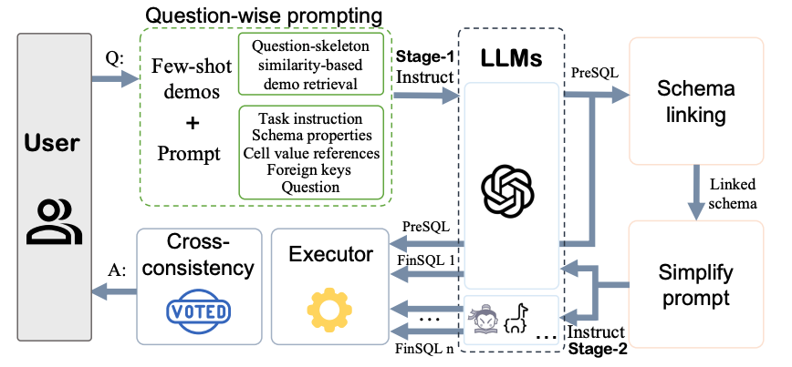

# The implementation code of "PET-SQL: A Prompt-enhanced Two-stage Text-to-SQL Framework with Cross-consistency"

## Overview


## RUN
```bash
docker pull zhishuailii/spider_envs:lastest
docker run --ipc=host -itd -v /your-local-path/PETSQL/src:/root/src -v /your-local-path/data:/root/data -v /your-local-path/test_database:/root/database --name spider_db_test_offline the-docker-iamge-ID
docker exec -it spider_db_test_offline bash run_all.sh
```

## Citation
```bibtex
@article{li2024pet,
  title={PET-SQL: A Prompt-enhanced Two-stage Text-to-SQL Framework with Cross-consistency},
  author={Li, Zhishuai and Wang, Xiang and Zhao, Jingjing and Yang, Sun and Du, Guoqing and Hu, Xiaoru and Zhang, Bin and Ye, Yuxiao and Li, Ziyue and Zhao, Rui and others},
  journal={arXiv preprint arXiv:2403.09732},
  year={2024}
}
```


